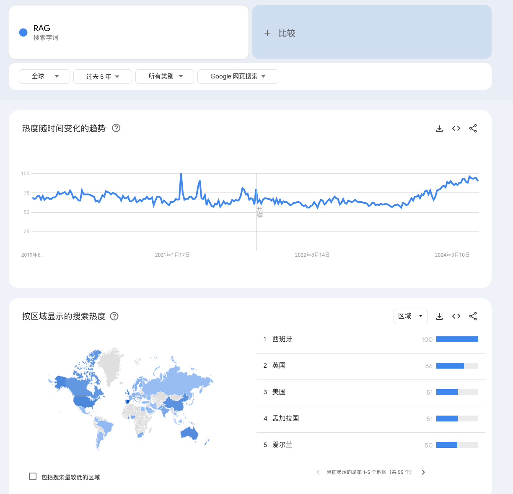

When examining the utilization of large-scale models in real-world applications, Retrieval-Augmented Generation (RAG) frequently presents itself as the initial solution.

Let's review the search popularity of RAG in recent years.

Over the past five years, the search popularity of RAG has not followed a singular growth trajectory but has exhibited volatility. The most recent significant surge took place in December 2023, coinciding with the rapid advancements in large-scale model technology, which saw the emergence of numerous new applications based on these models, with RAG once again emerging as a focal point.

## The hero of the prevalence of RAG

The widespread application and popularity of RAG technology are mainly due to the following key factors:

1.  **Effective utilization of external knowledge**：The RAG model can utilize external knowledge bases and reference a large amount of information to provide in-depth, accurate, and valuable answers, improving the reliability of generated text.
2.  **Timeliness of knowledge updates**：Equipped with a retrieval database update mechanism, it enables real-time updates of knowledge without the need for retraining models, adapting to application scenarios that require high timeliness.
3.  **Interpretability of replies**：The answer comes directly from the search library, which has strong interpretability and reduces the risk of hallucinations in large models.
4.  **Reduce training costs**：The RAG model has high scalability on data and can directly update the knowledge base without the need for retraining, reducing economic costs.
5.  **Security and privacy protection**：Implementing security control by restricting access to the knowledge base and protecting sensitive information from leakage.

### External knowledge base

The RAG model can provide rich, in-depth, and accurate information by integrating and utilizing external knowledge bases, greatly enhancing the reliability and quality of text generation. This integration is not limited to a single source or type of data, but spans the aggregation of multiple sources of information, including online encyclopedias, professional databases, user documents, etc., achieving the unity of structured and unstructured data.

:::tip[association]

Imagine RAG being a knowledgeable librarian. When you need to answer a complex question, this librarian can not only quickly find the most suitable books from the bookshelf, but also select the most accurate information fragments from numerous sources, providing you with detailed and in-depth answers.

:::

Compared to directly engaging in conversations with large language models, RAG models can significantly improve the accuracy and reliability of text generation with the assistance of external knowledge bases. It is like a thoughtful consultant, not only able to provide immediate feedback, but also ensuring the timeliness and authority of information. This dialogue method undoubtedly brings users a more efficient and accurate information acquisition experience.

### timeliness

In today's era of rapid knowledge iteration, **the timeliness of knowledge update** has become a key indicator to measure the progressiveness of technology. The reason why RAG (Retrieval Augmented Generation) technology is favored is largely due to its significant advantages in this dimension.

It can continuously absorb and integrate the latest information without the need for time-consuming and costly retraining of the entire model. This brings unprecedented flexibility and adaptability to RAG technology, enabling it to quickly respond to the latest developments in the field of knowledge.

### cost

When exploring the rise of RAG technology, cost is an undeniable factor. From a cost perspective, RAG technology provides an economically efficient solution, especially in the key dimensions of model training and data collection.

The cost of training a large model is enormous. This not only includes the consumption of computing resources, but also involves investment in electricity, maintenance, and professional technical teams, which often cost billions. However, RAG technology can effectively reduce dependence on model training through its retrieval enhancement mechanism. It does not require frequent comprehensive training or adjustment of the model, significantly reducing the cost in this regard.

In terms of data collection, although there is no need for a huge investment like training large models, data collection and processing still require a certain cost investment. RAG technology reduces the need for new data collection by utilizing existing knowledge bases and data resources. This not only reduces the cost of data collection, but also shortens the time cycle for data preparation.

It is worth noting that even when utilizing existing data, appropriate processing, including cleaning, labeling, and organization, is required to ensure the quality and availability of the data. Although this process requires some cost investment, its cost is much lower compared to collecting and training data from scratch. More importantly, properly annotated and organized data can be better integrated with RAG technology to provide users with more accurate and effective information.

### Privacy

In the digital age, privacy protection has become a focus of public attention, especially when dealing with and storing sensitive data. At the beginning of its design, RAG technology regards user privacy as one of its core considerations, ensuring the security and privacy of user knowledge bases through a series of measures.

RAG technology allows knowledge bases to be processed through local mounting. This means that user data can be stored on local servers or private cloud environments, rather than exposed to public networks or third-party servers. This localized processing method greatly reduces the risk of data leakage or unauthorized access.

Unlike traditional large-scale model training, RAG does not require uploading user data as training parameters to a central server. In the RAG model, the updating and retrieval process of the knowledge base is completed locally, ensuring the locality and privacy of the data. This approach not only protects user privacy, but also avoids potential security issues that may arise from data transmission.

## Shortcomings of RAG

Although RAG technology can often utilize existing knowledge bases to generate text, it may not always be able to perfectly utilize all the information in the knowledge base. Just like humans sometimes forget to cite important information when writing, RAG may also miss some key information when generating text. Especially in formal situations that require very precise and professional information, the content generated by RAG may not be as accurate and reliable as those natural language processing (NLP) systems trained specifically for specific tasks.

### Accuracy

RAG (Retrieval Augmented Generation) technology is an artificial intelligence model that combines retrieval and generation. It retrieves a large amount of existing knowledge or data, and then generates new text content based on this information. The advantage of this method is that it can provide richer and more diverse outputs, while also improving the relevance and accuracy of generated content based on retrieved information.

Compared to traditional statistical models, RAG technology can more effectively utilize existing structured information sources when generating content, thereby reducing the randomness of generated content to a certain extent. This allows RAG to perform better in scenarios that require high accuracy and reliability, such as academic writing, technical documents, etc.

**How should we evaluate the production content of RAG？**

Generally, we rely on manual evaluation to determine whether the content generated by RAG meets the expected quality, and use this as feedback to promote continuous optimization and iteration of the RAG system.

However, human evaluation of text content has a certain degree of subjectivity, which may affect the consistency and accuracy of the evaluation. Therefore, when evaluating the content generated by RAG, we should comprehensively consider multiple dimensions, such as relevance, accuracy, logicality, and readability, in order to obtain more comprehensive and objective evaluation results. At the same time, it is also possible to explore the establishment of standardized evaluation systems and automated evaluation tools to assist manual evaluation, improve the efficiency and reliability of evaluation.

## Reference link

1.   https://trends.google.com/trends/explore?q=RAG&hl=zh-CN
2.   https://arxiv.org/pdf/2005.11401
