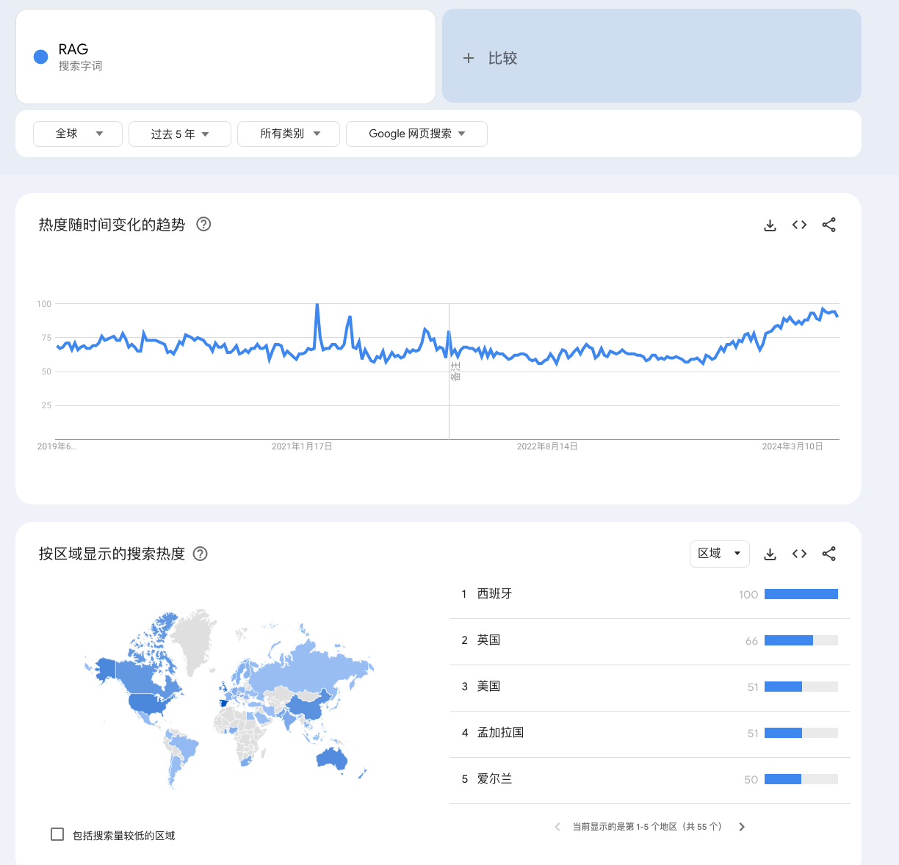

当我们讨论大型模型在实际应用中的运用，RAG（Retrieval-Augmented Generation，检索增强生成）往往是首先浮现在脑海中的解决方案。

让我们回顾这几年RAG的搜索热度。

在过去五年中，RAG的搜索热度并非呈现出单一的增长轨迹，而是呈现出波动性。最近的一次显著增长发生在2023年12月，正值大型模型技术迅速发展的时期，这一时期见证了大量基于大模型的新应用的诞生，RAG在其中再次成为焦点。

## RAG盛行的功臣

RAG技术的广泛应用和流行主要得益于以下几个关键因素：

1.  **外部知识的有效利用**：RAG模型能够利用外部知识库，引用大量信息以提供深入、准确、有价值的答案，提高了生成文本的可靠性。
2.  **知识更新的及时性**：具备检索库更新机制，实现知识的即时更新，无需重新训练模型，适应了对时效性要求高的应用场景。
3.  **回复的可解释性**：答案直接来自检索库，具有强可解释性，减少了大型模型产生幻觉的风险。
4.  **减少训练成本**：RAG模型在数据上具有很高的可扩展性，能够直接更新知识库而无需重新训练，降低了经济成本
5.  **安全和隐私保护**：通过限制知识库的访问权限实现安全控制，保护敏感信息不被泄露

### 外部知识库

RAG模型通过整合和利用外部知识库，能够提供丰富、深入且准确的信息，极大地增强了文本生成的可靠性和质量。这种整合**不仅限于单一来源或类型的数据**，而是跨越了多源信息汇聚，包括在线百科、专业数据库、用户文档等，实现了结构化与非结构化数据的统一。

:::tip[联想]

想象一下RAG是一位博学的图书管理员，当你需要解答一个复杂问题时，这位管理员不仅能够迅速从书架上找到最合适的书籍，还能从众多资料中挑选出最精准的信息片段，为你提供详尽而深入的答案。

:::

相较于直接与大型语言模型进行对话，RAG模型通过外部知识库的辅助，能够显著提高文本生成的准确性和可靠性。它如同一位经过深思熟虑的顾问，不仅能够提供即时的反馈，还能够确保信息的时效性和权威性。这种对话方式，无疑为用户带来了更为高效、精准的信息获取体验。

### 及时性

在当今这个知识迅速迭代的时代，**知识更新的及时性**已成为衡量技术先进性的关键指标。RAG（Retrieval-Augmented Generation）技术之所以受到青睐，很大程度上得益于其在这一维度上的显著优势。

它能够不断地吸纳和整合最新的信息，而无需对整个模型进行耗时且成本高昂的重新训练。这为RAG技术带来了前所未有的灵活性和适应性，使其能够迅速响应知识领域内的最新发展。

### 成本

在探讨RAG技术的兴起时，成本是一个不可忽视的因素。从成本的角度审视，RAG技术提供了一种经济高效的解决方案，尤其是在模型训练和数据采集这两个关键维度上。

训练一个大型模型的成本是巨大的。这不仅包括了计算资源的消耗，还涉及到了电力、维护以及专业技术团队的投入，这些成本往往以亿计。但是，RAG技术通过其检索增强的机制，能够有效降低对模型训练的依赖。它不需要频繁地对模型进行全面的训练或调整，从而显著减少了这方面的成本。

在数据采集方面，虽然不需要像训练大型模型那样的巨额投资，但数据的采集和处理仍然需要一定的成本投入。RAG技术通过利用现有的知识库和数据资源，减少了对全新数据采集的需求。这不仅降低了数据采集的成本，也缩短了数据准备的时间周期。

值得注意的是，即使是利用现有数据，也需要对数据进行适当的处理，包括清洗、标注和组织，以确保数据的质量和可用性。这一过程虽然需要一定的成本投入，但相比于从头开始采集和训练数据，其成本要低得多。更重要的是，合理标注和组织的数据能够与RAG技术更好地结合，从而提供给用户更加准确和有效的信息。

### 隐私

在数字化时代，**隐私保护**已成为公众关注的焦点，尤其是在处理和存储敏感数据时更需要注意。RAG技术在设计之初就将用户隐私作为核心考虑之一，通过一系列措施确保用户知识库的安全性和私密性。

RAG技术允许知识库通过**本地挂载**的方式进行处理。这意味着用户的数据可以存储在本地服务器或私有云环境中，而不是暴露在公共网络或第三方服务器上。这种本地化处理方式大大降低了数据泄露或被未授权访问的风险。

与传统的大型模型训练不同，RAG并不需要将用户的数据作为训练参数上传至中心服务器。在RAG模型中，知识库的更新和检索过程均在本地完成，确保了数据的本地性和私密性。这种方式不仅保护了用户隐私，也避免了因数据传输而可能产生的安全问题。

## RAG的不足

RAG技术，虽然在很多情况下能够利用已有的知识库来生成文本，但它并不总是能够完美地利用知识库中的所有信息。就像人类在写作时，有时也会忘记引用一些重要资料一样，RAG在生成文本时也可能遗漏一些关键信息。特别是在需要非常精确和专业信息的正式场合，RAG生成的内容可能就不如那些专门为特定任务训练的自然语言处理（NLP）系统来得准确和可靠。

### 准确率

RAG（Retrieval-Augmented Generation）技术是一种结合了检索（Retrieval）和生成（Generation）的人工智能模型。它通过检索大量已有的知识或数据，然后基于这些信息生成新的文本内容。这种方法的优势在于能够提供更加丰富和多样化的输出，同时也能够根据检索到的信息来提高生成内容的相关性和准确性。

相对于传统的基于统计学的大模型，RAG技术在生成内容时，可以更有效地利用已有的、结构化的信息源，从而在一定程度上减少生成内容的随机性。这使得RAG在处理需要较高准确性和可靠性的场景时，比如学术写作、技术文档等，可能会有更好的表现。

**我们应该如何评价RAG的生产内容？** 

一般的，我们依赖于人工评估来确定RAG生成的内容是否达到预期的质量，并以此作为反馈，促进RAG系统的持续优化和迭代。

但，人类对文本内容的评价具有一定的主观性，这可能会影响评估的一致性和准确性。因此，在评价RAG生成的内容时，我们应当综合考虑多个维度，如内容的相关性、准确性、逻辑性和可读性，以获得更全面和客观的评价结果。同时，也可以探索建立标准化的评价体系和自动化评估工具，以辅助人工评估，提高评价的效率和可靠性。

## 参考链接

1.   https://trends.google.com/trends/explore?q=RAG&hl=zh-CN
2.   https://arxiv.org/pdf/2005.11401
